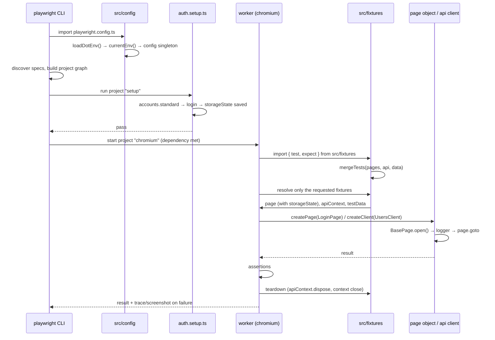

# Project Structure — AutomationPlaywright

Playwright + TypeScript end-to-end automation framework using the **Page Object Model
with merged custom fixtures**. This document maps every folder and file to its
responsibility, the layering rules between them, and where new code belongs.

---

## 1. Directory tree

```
AutomationPlaywright/
├── .env.example                  # every variable the framework reads (template)
├── .gitignore                    # ignores node_modules, reports, .env, .auth state
├── package.json                  # scripts + devDependencies (@playwright/test, typescript)
├── package-lock.json
├── tsconfig.json                 # strict TS, ES2022/CommonJS, @-path aliases, noEmit
├── playwright.config.ts          # projects, timeouts, reporters, baseURL, storageState
├── README.md                     # quick start & usage guide
├── STRUCTURE.md                  # this file
│
├── playwright/
│   └── .auth/                    # git-ignored signed-in storage states
│       └── .gitkeep              # keeps the folder in git
│
├── src/                          # framework code — never contains test specs
│   ├── config/
│   │   ├── env.ts                # dependency-free .env loader + typed getters
│   │   ├── environments.ts       # per-env URLs/timeouts table + resolved `config`
│   │   └── index.ts              # re-exports env + environments
│   │
│   ├── core/                     # base classes — rarely change
│   │   ├── base.page.ts          # BasePage (abstract)
│   │   ├── base.component.ts     # BaseComponent (abstract)
│   │   ├── step.ts               # reporter steps, safe outside a running test
│   │   ├── logger.ts             # level-aware console logger
│   │   └── index.ts
│   │
│   ├── pages/
│   │   └── index.ts              # placeholder + page-object template in comments
│   │
│   ├── components/
│   │   └── index.ts              # placeholder for shared UI components
│   │
│   ├── api/
│   │   ├── clients/
│   │   │   ├── base.client.ts    # BaseApiClient (abstract)
│   │   │   └── index.ts          # register resource clients here
│   │   ├── models/
│   │   │   └── index.ts          # API request/response interfaces
│   │   └── index.ts
│   │
│   ├── fixtures/                 # the layer tests import
│   │   ├── pages.fixture.ts      # createPage() + per-page fixtures
│   │   ├── api.fixture.ts        # apiToken, apiContext, createClient()
│   │   ├── data.fixture.ts       # testData: accounts + factories
│   │   └── index.ts              # mergeTests(...) -> exported `test` / `expect`
│   │
│   ├── data/
│   │   ├── credentials.ts        # accounts resolved from .env (lazy getters)
│   │   ├── factories/
│   │   │   └── user.factory.ts   # buildUser(), buildUsers()
│   │   ├── static/
│   │   │   └── README.md         # shared JSON/CSV fixture data lives here
│   │   └── index.ts
│   │
│   ├── utils/
│   │   ├── random.util.ts        # randomString/Int/Email/Pick, unique()
│   │   ├── date.util.ts          # today, addDays, toISODate, fileStamp
│   │   ├── file.util.ts          # ensureDir, readJson, writeJson, fileExists
│   │   ├── wait.util.ts          # sleep, pollUntil (non-UI waits only)
│   │   └── index.ts
│   │
│   └── types/
│       └── index.ts              # Credentials, UserRole, TestUser, Overrides<T>
│
└── tests/                        # specs only — no framework code
    ├── README.md                 # "where does a test go" table
    ├── example.spec.ts           # Playwright scaffold sample (safe to delete)
    ├── setup/
    │   └── auth.setup.ts         # logs in once, saves storage state
    ├── ui/.gitkeep               # single-feature UI specs
    ├── e2e/.gitkeep              # cross-feature journeys
    └── api/.gitkeep              # API-only specs (no browser)
```

Generated at runtime and git-ignored: `test-results/`, `playwright-report/`,
`blob-report/`, `playwright/.cache/`, `playwright/.auth/user.json`, `.env`.

---

## 2. Layers and dependency direction

```
tests/*.spec.ts
      │  imports only
      ▼
src/fixtures          ← the single entry point for specs (`test`, `expect`)
      │
      ├──► src/pages       ──► src/core/base.page
      ├──► src/components  ──► src/core/base.component
      ├──► src/api/clients ──► src/core/logger
      └──► src/data        ──► src/utils, src/types
                                   │
                                   ▼
                            src/config (env + environments)
```

Rules:

- A spec imports **only** `src/fixtures` (plus its own page/client classes when using
  `createPage` / `createClient`). It never imports `@playwright/test` directly.
- `src/core` stays application-agnostic — base classes and the logger, nothing else.
- Page objects hold locators and intent-revealing actions; test-specific assertions
  stay in the spec, page-level assertions live on the page object as `expectX()`.
- Secrets never live in source — only in `.env` / CI secrets, read through
  `src/config/env.ts`.

---

## 3. File-by-file responsibilities

### Root configuration

| File | Responsibility |
|---|---|
| `playwright.config.ts` | Loads `.env`, sets `testDir: ./tests`, `outputDir: ./test-results`, full parallelism, CI retries (2) and workers (4), timeouts from `config.timeouts`, reporters (list + html, plus junit on CI), and `use` defaults: `baseURL`, trace/screenshot/video on failure, `testIdAttribute: 'data-testid'`. Defines the projects (§4). |
| `tsconfig.json` | Strict ES2022/CommonJS, `noEmit`, and the `@`-aliases in §5. Includes `src/**/*.ts`, `tests/**/*.ts`, `playwright.config.ts`. |
| `.env.example` | Documents every variable: `TEST_ENV`, `BASE_URL`, `API_URL`, `USER_*` / `ADMIN_*` accounts, `API_TOKEN`, the four timeout overrides, `LOG_LEVEL`. |
| `package.json` | Scripts (§6) and devDependencies only — no runtime dependencies beyond Playwright. |

### `src/config`

| File | Exports |
|---|---|
| `env.ts` | `loadDotEnv()` (hand-rolled `.env` parser that never overwrites real env vars), the internal `readEnv()`, `envVar()`, `envFlag()`, `envNumber()`, `currentEnv()` (validates local / dev / staging / prod), `isCI`, type `EnvName`. Resolution order: process env → `.env` → declared default. **A blank value counts as absent** at both layers — `KEY=` is skipped by the parser and an empty `process.env` value is ignored by `readEnv()` — so `.env.example`'s empty placeholders can never override the `environments.ts` table with `''` or a `0` timeout. |
| `environments.ts` | `EnvironmentConfig` interface, the per-environment table of `baseURL` / `apiURL` / timeouts, `getConfig()` (applies `.env` overrides on top of the table) and the resolved singleton `config`. |

### `src/core`

| File | Exports |
|---|---|
| `base.page.ts` | `abstract class BasePage` — `path` field, `open()`, `waitUntilLoaded()`, `title`, `url`, `reload()`, `screenshot()`, plus protected `step()`, `clickWhenReady()`, `fillIfPresent()`, `isVisible()`. `open`, `reload` and `screenshot` are already wrapped in reporter steps. |
| `base.component.ts` | `abstract class BaseComponent` — root-locator-scoped UI piece with `isVisible()` and `waitForVisible()`. |
| `step.ts` | `step(title, body)` — wraps an action in a `test.step` when a test is running and simply runs it otherwise; `currentTestInfo()` returns the running `TestInfo` or `undefined`. Used by `BasePage` and `BaseApiClient`, so base classes stay usable from global setup and scripts. |
| `logger.ts` | `logger.debug/info/warn/error`, filtered by `LOG_LEVEL`; `LogLevel` type. |

### `src/api`

| File | Exports |
|---|---|
| `clients/base.client.ts` | `RequestOptions` and `abstract class BaseApiClient` — `basePath`, `url()`, `authHeaders()` (bearer token), `send()` (logs, throws on non-2xx unless `expectOk: false`) and `json<T>()`. |
| `clients/index.ts` | Barrel; new resource clients (`UsersClient`, `OrdersClient`, …) are exported here. |
| `models/index.ts` | Request/response interfaces shared by clients, factories and specs. |

### `src/fixtures`

| File | Provides |
|---|---|
| `pages.fixture.ts` | `PageObjectClass<T>`, `PageFixtures`, and the `createPage(PageClass)` fixture; commented slots for dedicated page fixtures. |
| `api.fixture.ts` | `apiToken` (from `API_TOKEN`, or a real login call), `apiContext` (an `APIRequestContext` pointed at `config.apiURL`, disposed after the test) and `createClient(ClientClass)`. |
| `data.fixture.ts` | `testData` = `{ accounts, buildUser, buildUsers }`. |
| `index.ts` | `mergeTests(pagesFixture, apiFixture, dataFixture)` exported as `test`, plus `expect` and the three fixture types. |

### `src/data`, `src/utils`, `src/types`

| File | Exports |
|---|---|
| `data/credentials.ts` | `accounts.standard` / `accounts.admin` as lazy getters reading `.env`. |
| `data/factories/user.factory.ts` | `buildUser(overrides?)`, `buildUsers(count, overrides?)` — valid-by-default `TestUser`s with unique names. |
| `utils/random.util.ts` | `randomString`, `randomInt`, `randomEmail`, `randomPick`, `unique` (no faker dependency). |
| `utils/date.util.ts` | `today`, `addDays`, `toISODate`, `fileStamp`. |
| `utils/file.util.ts` | `ensureDir`, `readJson<T>`, `writeJson`, `fileExists`. |
| `utils/wait.util.ts` | `sleep`, `pollUntil` + `PollOptions` — for non-UI waits only. |
| `types/index.ts` | `Credentials`, `UserRole`, `TestUser`, `Overrides<T>`. |

### `tests`

| Path | Contains |
|---|---|
| `tests/setup/auth.setup.ts` | Setup project: signs in with `accounts.standard` and saves `playwright/.auth/user.json`. Writes an empty state (with a warning) when credentials are absent, so dependent projects can still run. Add one setup file per role. |
| `tests/ui/` | Single-page / single-feature UI checks, authenticated by default. |
| `tests/e2e/` | Multi-page business journeys that cross features. |
| `tests/api/` | Pure API specs — no browser is launched. |
| `tests/example.spec.ts` | Playwright's scaffold sample against playwright.dev; delete once real specs exist. |

---

## 4. Playwright projects

| Project | Test scope | Notes |
|---|---|---|
| `setup` | `**/*.setup.ts` | Runs first; produces the storage state. |
| `api` | `tests/api` | `baseURL` = `config.apiURL`; no browser. |
| `chromium` | `**/{ui,e2e}/**/*.spec.ts`, `grepInvert: @guest` | Desktop Chrome, signed in via `storageState`; `dependencies: ['setup']`. |
| `chromium-guest` | `**/{ui,e2e}/**/*.spec.ts`, `grep: @guest` | Desktop Chrome with no storage state — login, registration, error paths. |
| `firefox`, `mobile-chrome` | — | Commented out; enable once the suite is stable on Chromium. |

Tag-driven filtering is used throughout: `@guest` selects the signed-out project,
`@smoke` and `@regression` are targeted by npm scripts.

---

## 5. Path aliases (`tsconfig.json`)

| Alias | Target |
|---|---|
| `@config/*` | `src/config/*` |
| `@core/*` | `src/core/*` |
| `@pages/*` | `src/pages/*` |
| `@components/*` | `src/components/*` |
| `@api/*` | `src/api/*` |
| `@fixtures/*` | `src/fixtures/*` |
| `@data/*` | `src/data/*` |
| `@utils/*` | `src/utils/*` |
| `@app-types/*` | `src/types/*` |

---

## 6. npm scripts

| Script | Command |
|---|---|
| `test` | `playwright test` |
| `test:ui` | `playwright test --project=chromium` |
| `test:api` | `playwright test --project=api` |
| `test:guest` | `playwright test --project=chromium-guest` |
| `test:headed` | `playwright test --project=chromium --headed` |
| `test:debug` | `playwright test --debug` |
| `test:watch` | `playwright test --ui` |
| `test:smoke` | `playwright test --grep @smoke` |
| `test:regression` | `playwright test --grep @regression` |
| `report` | `playwright show-report` |
| `trace` | `playwright show-trace` |
| `codegen` | `playwright codegen` |
| `typecheck` | `tsc --noEmit` |
| `install:browsers` | `playwright install --with-deps` |

---

## 7. Where new code goes

| You are adding… | Put it in | Then |
|---|---|---|
| A new screen | `src/pages/<name>.page.ts` extending `BasePage` | export from `src/pages/index.ts`; optionally add a fixture in `pages.fixture.ts` |
| A reusable UI piece | `src/components/<name>.component.ts` extending `BaseComponent` | export from `src/components/index.ts` |
| A new API resource | `src/api/clients/<name>.client.ts` extending `BaseApiClient` | export from `clients/index.ts`; add its types to `api/models` |
| Generated test data | `src/data/factories/<name>.factory.ts` | expose through `data.fixture.ts` if specs need it |
| Stable shared payloads | `src/data/static/*.json` | load with `readJson()` or import directly (`resolveJsonModule` is on) |
| A UI spec | `tests/ui/<feature>.spec.ts` | import `{ test, expect }` from `src/fixtures` |
| A journey spec | `tests/e2e/<journey>.spec.ts` | tag `@guest` if it must start signed out |
| An API spec | `tests/api/<resource>.spec.ts` | runs under the `api` project (no browser) |
| A new environment | `src/config/environments.ts` | add the key to `EnvName` in `src/config/env.ts` |
| A second logged-in role | `tests/setup/<role>.setup.ts` | write its own `playwright/.auth/<role>.json` and add a project that uses it |

---

## 8. Execution flow — what runs, and in what order

### 8.1 Stage 0 — config module graph (before any test exists)

`npm test` → `playwright test` → the CLI imports `playwright.config.ts`, and that single
import triggers the whole config chain:

```
playwright.config.ts
 └─ import { config } from './src/config/environments'
     └─ import … from './env'
         ├─ env.ts body defines loadDotEnv / envVar / envFlag / envNumber / currentEnv
         └─ env.ts evaluates `export const isCI = envFlag('CI')`
             └─ calls loadDotEnv()  ← .env is parsed HERE, as an import side effect
     └─ environments.ts evaluates `export const config = getConfig()`
         ├─ currentEnv()  → validates TEST_ENV against local|dev|staging|prod
         ├─ picks the matching block from the `environments` table
         └─ applies BASE_URL / API_URL / *_TIMEOUT overrides from .env
 └─ top-level loadDotEnv()  → no-op, the `loaded` flag is already true
 └─ defineConfig({ … })     → reads config.baseURL, config.timeouts, isCI, currentEnv()
```

**Consequence to remember:** `config` is a module-level singleton computed at import time.
Mutating `process.env` inside a test will *not* change `config`, and this chain re-runs
once in every worker process, not once per run.

### 8.2 Stage 1 — discovery and the project graph

Playwright scans `testDir` per project and builds the dependency graph:

```
setup ──(dependencies)──► chromium
api            (independent, starts immediately)
chromium-guest (independent, starts immediately)
```

Current resolution, from `playwright test --list`:

```
[setup] › setup\auth.setup.ts:14:6 › authenticate as standard user
Total: 1 test in 1 file
```

Two things that follow from this: `tests/ui`, `tests/e2e` and `tests/api` are still empty,
and **`tests/example.spec.ts` is matched by no project at all** — it sits directly in
`tests/`, so the `{ui,e2e}` testMatch skips it, the `api` project's `testDir` excludes it,
and `setup` only takes `*.setup.ts`. It never runs. Delete it, or move it into `tests/ui/`
if you want it as a live smoke check.

### 8.3 Stage 2 — the `setup` project

```
worker process starts
 └─ loads tests/setup/auth.setup.ts
     └─ imports src/data/credentials  → src/config/env   (.env parsed in this process)
     └─ imports src/core/logger
 └─ built-in fixtures on demand: browser (worker scope) → context → page
 └─ test body
     ├─ accounts.standard            → getter runs envVar('USER_USERNAME'/'USER_PASSWORD')
     ├─ credentials blank?  → logger.warn → fs.writeFileSync empty storage state → return
     └─ credentials present → page.goto('/login') → fill → click
                            → expect(Log out).toBeVisible()
                            → context.storageState({ path: playwright/.auth/user.json })
```

The `chromium` project starts only after this passes.

### 8.4 Stage 3 — worker bootstrap for a UI / E2E spec

```
spec: import { test, expect } from '../../src/fixtures'
 └─ src/fixtures/index.ts
     ├─ pages.fixture.ts  → src/core/base.page → src/core/logger
     ├─ api.fixture.ts    → src/config/environments (→ env)   [BaseApiClient is a type-only import]
     ├─ data.fixture.ts   → src/data/credentials      (→ env)
     │                    → src/data/factories/user.factory → src/utils/random.util, src/types
     └─ mergeTests(pagesFixture, apiFixture, dataFixture) → the exported `test`
```

### 8.5 Stage 4 — per-test fixture resolution

Playwright builds only the fixtures a test actually names in its destructured argument.
Resolution follows the dependency edges:

```
browser (worker)
   └─ context  ── storageState from the project's `use`
        └─ page
             └─ createPage        ← closure that news up page objects

apiToken (test scope; reads API_TOKEN)
   └─ apiContext  ── request.newContext({ baseURL: config.apiURL, Authorization })
        └─ createClient           ← closure that news up API clients

testData (no dependencies) → { accounts, buildUser, buildUsers }
```

So `test('…', async ({ testData }) => …)` starts no browser context beyond the project
default and never creates an `apiContext`.

### 8.6 Stage 5 — the test body: which classes actually construct

| Call in a spec | Class chain that runs |
|---|---|
| `createPage(LoginPage)` | `new LoginPage(page)` → `BasePage` constructor stores `page`; the class's locator fields are evaluated now, but locators are lazy — no DOM query yet |
| `loginPage.open()` | `BasePage.open()` → `step('LoginPage: open "/login"')` → `logger.debug` → `page.goto(path, { waitUntil: 'domcontentloaded' })` |
| `loginPage.someAction()` | subclass method → `this.step(…)` → optionally `BasePage.clickWhenReady()` / `fillIfPresent()` |
| `loginPage.screenshot('x')` | `step(…)` → `currentTestInfo().outputPath('x.png')` → `page.screenshot` → `testInfo.attach()` — per-test path, so parallel workers never collide |
| `new Header(page, root)` inside a page object | `BaseComponent` constructor → root-scoped locators |
| `createClient(UsersClient)` | `new UsersClient(apiContext, apiToken)` → `BaseApiClient` constructor |
| `users.getById('1')` | `BaseApiClient.json()` → `.send()` → `step('API GET /users/1')` → `logger.debug` → `authHeaders()` → `request.get(url)` → throws a formatted error when `!response.ok()` and `expectOk` is not `false` |

### 8.7 Stage 6 — teardown and reporting

Fixtures tear down in reverse creation order: `apiContext.dispose()` → page/context closed
→ trace, screenshot and video retained **only on failure** → `list` + `html` reporters
(plus `junit` on CI) write to `test-results/` and `playwright-report/`.

### 8.8 Which "classes" are live at runtime

| Symbol | Kind | Who creates it | When |
|---|---|---|---|
| `config` | plain object singleton | `environments.ts` module body | at first import, once per process |
| `logger` | object literal (not a class) | module body | at import; `LOG_LEVEL` is re-read on every call |
| `accounts` | object with lazy getters | module body | the **getter** runs at property access, so a missing `.env` fails at use, not at import |
| `BasePage` | abstract | never directly | only via a subclass, through `createPage()` or `new` |
| `BaseComponent` | abstract | a page object | when the page object builds its components |
| `BaseApiClient` | abstract | never directly | only via a subclass, through `createClient()` |

Because `src/pages`, `src/components` and `src/api/clients` currently hold only
placeholders, **a run today instantiates none of these classes** — the only executable
test is `auth.setup.ts`, which uses raw `page` locators. The base classes come alive as
soon as the first real page object or API client lands.

### 8.9 End-to-end sequence



### 8.10 Note on `apiToken`

Its doc comment says *"resolved once per worker"*, but it is declared with
`{ scope: 'test' }`, so it is resolved once **per test**. That is harmless while it only
reads `process.env.API_TOKEN`; if you replace it with a real login call, switch the scope
to `'worker'` so the suite does not authenticate once per test.
